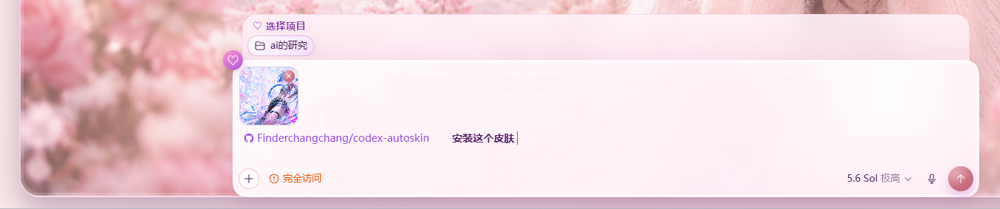
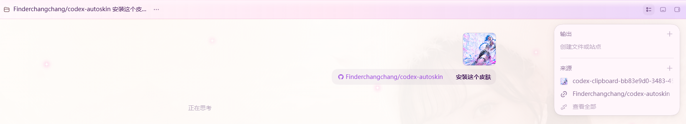
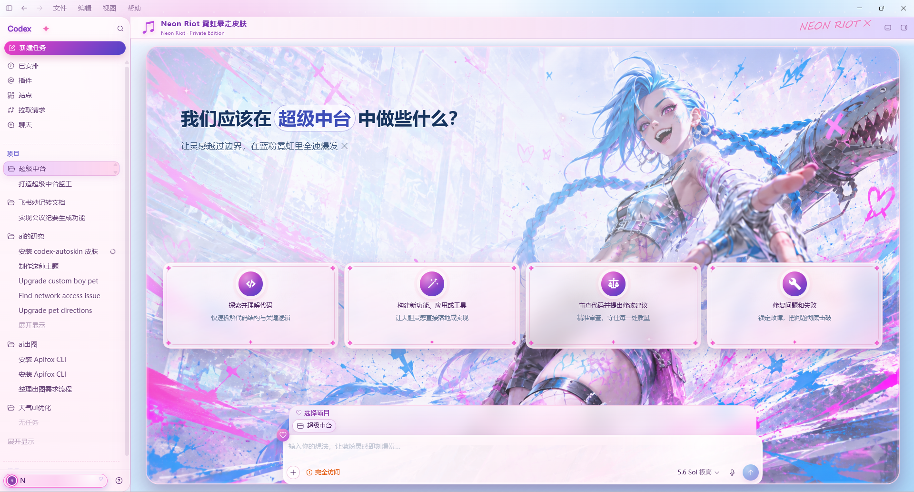

<div align="center">

# Codex AutoSkin

**发一张图，你的 Codex 换上专属皮肤**


两分钟上手 · 不改任何官方文件 · 一键还原 · Windows & macOS

[快速开始](#-快速开始) · [特性](#-特性) · [路线图](#-路线图) · [FAQ](#-faq) · [English](#english)

</div>

---

## 🎬 真实演示

把仓库链接和一张图丢给你的 Codex，说一句 **"安装这个皮肤"**：



Codex 自己克隆、安装、从图里生成主题：



完成——从一张图到专属皮肤，全程无人工：



> 演示主题由一张同人图经本流程生成，仅作流程演示；示例素材版权归原权利人。请勿用他人肖像或受版权保护的素材制作并**公开传播**主题（自用请放 `themes-private/`）。

> 📌 **本项目只做第一步。** 大家都有 Codex，缺的只是"把一张图变成能用的皮肤底子"（背景 + 配色 + 全屏/横幅两版式）——这一步我们做到极简。至于边框、贴纸、卡片这些细节怎么玩，开动你的脑洞，让你的 agent 照 [THEME-SPEC.md](THEME-SPEC.md) 帮你实现。后续会陆续出教程。

### ⚡ 最快上手：复制这句话

把下面这句话发给你的 Codex，顺手附一张你喜欢的图（横向、主体靠右、无文字水印）：

```text
安装这个 Codex 皮肤引擎：https://github.com/Finderchangchang/codex-autoskin ，装好后用我附的这张图生成一个主题并立即应用
```

剩下的全自动。没附图也行——它会先带着内置主题亮起来，之后随时补图。不想用 AI？往下看各平台的手动版。

<details>
<summary><b>📖 目录</b></summary>

- [特性](#-特性)
- [快速开始](#-快速开始)
- [日常使用](#-日常使用)
- [做自己的主题](#-做自己的主题)
- [工作原理与安全](#-工作原理与安全)
- [路线图](#-路线图)
- [FAQ](#-faq)
- [参与贡献](#-参与贡献)
- [关于](#-关于)
- [免责声明](#%EF%B8%8F-免责声明)
- [License](#-license)
- [English](#english)

</details>

## ✨ 特性

- 🖼 **一张图生成主题** — Windows 一条命令 / macOS 双击选图：自动取色、自动判断明暗路线、生成主题、立即生效
- ⚡ **上手极简** — Windows 两条命令；macOS 双击安装，直接复用 Codex 内置的 Node.js，普通用户零依赖
- 📁 **主题即文件夹** — 一个 `theme.json` + 一张图就是一个主题，增删主题零改码
- 🎨 **屏内主题切换** — 沿用原版 Dream 设计，从侧栏选择主题；可一键撤销，也可切回完全无皮肤的 Codex 原版
- 🤖 **AI 精修（可选）** — 把仓库丢给你的 Codex / Claude，照 [THEME-SPEC.md](THEME-SPEC.md) 深度定制裁剪、文案、贴纸
- 🔒 **安全可逆** — CDP 仅本机回环注入，不碰 `WindowsApps`、应用 bundle 或 `app.asar`，登录态会话原样保留，一条命令还原
- 🛡 **稳定守护** — 双栈端口探测、崩溃防抖熔断、装饰层命中测试；Windows 用 Startup watcher、macOS 用 LaunchAgent，重启 Codex 后皮肤自动恢复

## 🚀 快速开始

### Windows：两条命令

前提：Windows 10/11、Microsoft Store 版 Codex（打开并登录过一次）、[Node.js ≥ 20](https://nodejs.org/zh-cn)。

```powershell
git clone https://github.com/Finderchangchang/codex-autoskin.git   # 或 Download ZIP 解压
cd codex-autoskin

.\quickstart.ps1                             # ① 安装并启动，Codex 带内置主题亮起
.\quick-theme.ps1 -Image C:\path\你的图.png   # ② 你的图变成主题，立即生效
```

不满意配色？换张图重跑即可；`-Name 名字` 可给主题命名。提示"禁止运行脚本"见 [FAQ](#-faq)。

### macOS：三步，双击即可

前提：官方 Codex Mac 客户端（打开并登录过一次）。**不需要安装 Node.js**——脚本会自动使用 Codex 内置的运行时。

1. **下载解压**——GitHub 页面 Code → Download ZIP，Finder 打开 `codex-autoskin` 文件夹；
2. **双击安装**——打开 `Install AutoSkin on macOS.command`（Codex 在运行时会先询问是否重启）；
3. **选图生成**——打开 `Create AutoSkin Theme on macOS.command` 选一张 PNG/JPG（或把图直接拖到该文件上），自动取色、生成、应用。

普通安装使用原有 Codex profile，**不会清空项目、任务、聊天记录或登录状态**。提示"无法验证开发者"见 [FAQ](#-faq)。终端党等价命令：

```bash
scripts/autoskin-macos.sh install
scripts/autoskin-macos.sh quick-theme "/path/to/你的图.png" --name my-theme
```

**图片要求（两端一致）**：PNG / JPG，横向图宽度 ≥ 1600，主体尽量靠右（左侧压标题文字），画面无文字 / 水印 / 界面元素，素材版权责任自负。

<details>
<summary><b>🖼 内置主题预览（Aurora Veil / Ember Bloom）</b></summary>

| Aurora Veil（暗图路线） | Ember Bloom（亮图路线） |
|---|---|
|  |  |
|  |  |

> 内置主题素材均为程序化生成的原创图片，仓库不含任何真人照片；截图侧栏已模糊、项目名为演示示例。

</details>

<details>
<summary><b>🍎 macOS 进阶用法（稳定入口 / 常用选项）</b></summary>

安装时会把自包含运行文件原子同步到 `~/Library/Application Support/CodexDreamSkin/runtime`，个人主题另存于旁边的 `themes-private`（更新运行文件不会丢）。删掉下载的仓库后仍可用稳定入口：

```bash
"$HOME/Library/Application Support/CodexDreamSkin/runtime/scripts/autoskin-macos.sh" start
"$HOME/Library/Application Support/CodexDreamSkin/runtime/scripts/autoskin-macos.sh" quick-theme "/path/to/image.jpg" --name my-theme
```

常用命令（安装时选的端口 / App 路径会被记住，无需重复传参）：

```bash
scripts/autoskin-macos.sh doctor                                  # 体检：App、内置 Node、状态目录、CDP 端口
scripts/autoskin-macos.sh theme ember-bloom fullscreen            # 切主题
scripts/autoskin-macos.sh verify --screenshot "$PWD/shot.png"     # 验证 + 按原生窗口 ID 截图
scripts/autoskin-macos.sh uninstall                               # 完整卸载（可重复执行）
scripts/install-dream-skin.sh --app "$HOME/Apps/ChatGPT.app"      # 非标准安装位置
scripts/autoskin-macos.sh install --port 19335                    # 端口被占时指定一次即可
```

排查日志都在 `~/Library/Application Support/CodexDreamSkin/`：`injector-error.log`（主题扫描/注入）、`watcher.log`（自动恢复/熔断）、`launch-agent-error.log`（LaunchAgent）。

</details>

## 🎨 日常使用

安装后，在 Codex 侧栏底部点击 **Themes**。面板不会遮暗或锁住当前任务，只负责切换原版 Dream 主题；可以连续比较主题，也可以撤销本次打开面板后的修改。首页建议卡片默认隐藏，可用 **Show suggestion cards** 随时打开并记住选择。点击 **Codex Original** 会撤掉背景、配色和装饰并记住该状态；侧栏入口仍保留，选择任一主题即可重新启用 AutoSkin。

```powershell
node scripts\set-theme.mjs --list                  # 列出全部主题（两端通用）
node scripts\set-theme.mjs aurora-veil fullscreen  # 切主题 + 版式（banner / fullscreen）
scripts\restore-dream-skin.ps1                     # Windows 一键还原官方外观
```

```bash
scripts/autoskin-macos.sh theme aurora-veil fullscreen   # macOS 切主题
scripts/restore-dream-skin.sh                            # macOS 一键还原官方外观
```

选择自动持久化；也可以直接跟你的 Codex 说"切到极光主题"。

## 🛠 做自己的主题

**快速**：Windows `quick-theme.ps1` / macOS `quick-theme` 命令（见上），覆盖背景替换 + 基础配色，全屏 / 横幅两种版式。

**进阶**：把仓库和图丢给你的 Codex / Claude，说 **"照着 THEME-SPEC.md 精修 <主题名> 主题"**。[THEME-SPEC.md](THEME-SPEC.md) 是写给 AI agent 读的完整规范。内置的 [aurora-veil](themes/aurora-veil/theme.json)（暗图路线）与 [ember-bloom](themes/ember-bloom/theme.json)（亮图路线）是两份对照样例。

## 🔍 工作原理与安全

技术栈：PowerShell / POSIX shell + Node.js + Chrome DevTools Protocol，无第三方依赖。

以 `--remote-debugging-port=9335`（仅本机回环）启动官方 Codex（Windows 的 `ChatGPT.exe` / macOS 的 `ChatGPT.app`，mac 端经 LaunchServices 启动），通过 CDP 向主渲染器注入一段 CSS + JS：

- 不替换、不修改、不重签任何官方文件与应用 bundle，登录态 / 会话 / 插件保持原样
- 平台对应的 `restore-dream-skin` 脚本现场移除全部注入内容；完整卸载 Windows 加 `-Uninstall -RestoreBaseTheme`，macOS 加 `--uninstall --restore-base-theme`（可安全重复执行）
- 运行时状态分别位于 `%LOCALAPPDATA%\CodexDreamSkin` 与 `~/Library/Application Support/CodexDreamSkin`，删除即无痕
- 隐藏 watcher 在 Codex 正常重启后自动补皮肤（防抖 + 频率熔断 + 失败冷却，绝不与应用打架）；macOS 的 LaunchAgent 不会打断安装前已打开的 Codex
- 桌面宠物等辅助渲染窗口永不注入，保持透明

> 脚本名与内部标识沿用 `dream` 前缀——那是默认风格包的名字，也是对初版的致敬。

## 🗺 路线图

- [x] 两条命令冷启动（quickstart / quick-theme）
- [x] 一张图自动取色生成主题（明 / 暗双路线）
- [x] AI 精修规范 THEME-SPEC.md
- [x] macOS 适配 —— ✅ 社区贡献，感谢 [@keyuchen21](https://github.com/keyuchen21)
- [x] 侧栏主题切换、Codex 原版恢复与单次撤销
- [ ] 演示 GIF / 视频教程系列
- [ ] 社区主题展示墙
- [ ] 更多风格包（当前内置 dream 风格）

## ❓ FAQ

**Windows 提示"禁止运行脚本"？**
先执行 `Set-ExecutionPolicy -Scope CurrentUser RemoteSigned`；ZIP 下载的再执行 `Get-ChildItem -Recurse | Unblock-File`。

**macOS 提示"无法验证开发者"？**
右键 `.command` 文件 → **打开**，再确认一次。提示没有执行权限则在仓库目录运行 `chmod +x ./*.command ./scripts/*.sh`；仍被下载隔离拦截且确认文件来自本仓库时，可运行 `xattr -dr com.apple.quarantine "/path/to/codex-autoskin"`。

**macOS 截图验证失败？**
给运行命令的终端（或 agent）授予"屏幕录制"权限后重试——mac 端按原生窗口 ID 截图，被其它窗口遮挡也不会截错。

**Codex 更新后皮肤消失了？**
Windows 重跑 `.\quickstart.ps1`；macOS 重跑 `scripts/autoskin-macos.sh install`。两端都动态发现当前应用，不存版本化路径。

**端口 9335 被占用？**
Windows：`.\quickstart.ps1 -Port 9345`，后续脚本保持同端口。macOS：`scripts/autoskin-macos.sh install --port 19335`，之后的统一命令会记住它。

**会影响我的 Codex 账号和数据吗？**
不会改任何官方文件、不碰登录态与会话，注入仅在本机回环进行；属装饰性社区项目，见[免责声明](#%EF%B8%8F-免责声明)。

**影响性能吗？**
注入的是一层纯 CSS/JS 装饰与一个轻量守护进程，正常使用感知不到。

**怎么彻底卸载？**
Windows：`scripts\restore-dream-skin.ps1 -Uninstall -RestoreBaseTheme`；macOS：`scripts/autoskin-macos.sh uninstall`。之后正常启动 Codex 即为纯官方状态。

**支持哪些平台？**
Windows（Store 版 Codex）与 macOS（官方桌面客户端）。Linux 暂未支持，欢迎 PR。

## 🤝 参与贡献

欢迎三类贡献：**新主题**（PR 一个 `themes/` 文件夹 + 截图）、**平台适配 / 引擎修复**、**文档与教程**。规则见 [CONTRIBUTING.md](CONTRIBUTING.md)。

## 💬 关于

用 CDP 注入给 Codex 换肤的初版（当时叫 **Dream Skin**）出自我之手，很高兴看到这个玩法在社区里开枝散叶。AutoSkin 是对这个想法的全面重写：v1 回答"能不能换肤"，这一版回答"怎么让任何人发一张图就得到自己的皮肤"。

整个 2.0 由作者与 AI 结对完成，从定位、架构到每一次翻车的完整决策记录公开在 [DEVLOG.md](DEVLOG.md)——算是一次全程透明的赛博开发实验，会随迭代持续更新。macOS 支持由社区贡献者 [@keyuchen21](https://github.com/keyuchen21) 完成，发布次日抵达——开源精神照进现实。

## ⚠️ 免责声明

- 装饰性社区项目，**与 OpenAI 无关**；Codex 及相关商标归其权利人所有
- Codex 桌面端更新可能改变内部结构，届时需重新适配（按语义选择器定位，小更新通常无感）
- 用户自制主题素材的版权与肖像权责任自负；不得使用他人肖像制作并公开传播主题，私人主题请放入已 gitignore 的 `themes-private/`

## 📄 License

[MIT](LICENSE) © Vikicc

---

## English

**Send one image — your Codex gets its own skin.**

A skin engine for the Windows & macOS Codex desktop apps. Injects CSS/JS into the official renderer over Chrome DevTools Protocol (loopback only): no app files modified, fully reversible, login/session untouched.

**Fastest path** — paste this to your Codex along with an image you like:

```text
Install this Codex skin engine: https://github.com/Finderchangchang/codex-autoskin , then use the attached image to generate a theme and apply it
```

**Manual quick start**

Windows (Store Codex signed in once, [Node.js ≥ 20](https://nodejs.org/)):

```powershell
git clone https://github.com/Finderchangchang/codex-autoskin.git
cd codex-autoskin
.\quickstart.ps1                            # install & launch with a bundled theme
.\quick-theme.ps1 -Image C:\path\your.png   # your image becomes a live theme
```

macOS (official Codex app signed in once — no separate Node.js needed, the app's bundled runtime is reused): download/unzip, right-click → Open `Install AutoSkin on macOS.command`, then open `Create AutoSkin Theme on macOS.command` and pick a PNG/JPG. Terminal equivalents: `scripts/autoskin-macos.sh install` and `scripts/autoskin-macos.sh quick-theme /path/to/image.png --name my-theme`. Installation keeps the existing Codex profile (projects, tasks, chats, login all preserved) and copies a self-contained runtime to `~/Library/Application Support/CodexDreamSkin/runtime`; the unified command also supports `theme`, `verify`, `doctor`, and repeatable `uninstall`. If Gatekeeper blocks a script, right-click → Open; grant Screen Recording for screenshot verification.

**Features**: one-image theme generation · original Dream design · a modeless in-app theme picker with native restore and undo · themes as plain folders · optional AI refinement with [THEME-SPEC.md](THEME-SPEC.md) · advanced CLI switching via `node scripts/set-theme.mjs <theme> [banner|fullscreen]` · fully reversible uninstall.

Image tips: PNG/JPG, landscape ≥ 1600 px, subject on the right (the left side carries the title), clean art without text/watermark/UI. You are responsible for the rights to images you use; never publish themes using a real person's likeness (keep private themes in git-ignored `themes-private/`).

**This project deliberately does step one only** — turning one image into a usable skin base (background + palette, both layouts). Frames, stickers and card details are yours to invent: hand [THEME-SPEC.md](THEME-SPEC.md) to your agent.

Originally created as **Dream Skin** (v1) by the same author — AutoSkin is the full rewrite; the whole build was pair-programmed with AI, decision log in [DEVLOG.md](DEVLOG.md). macOS support contributed by [@keyuchen21](https://github.com/keyuchen21). Decorative community project, not affiliated with OpenAI. Bundled demo art is 100% procedurally generated; no photos of real people in this repo.

[MIT](LICENSE) © Vikicc
